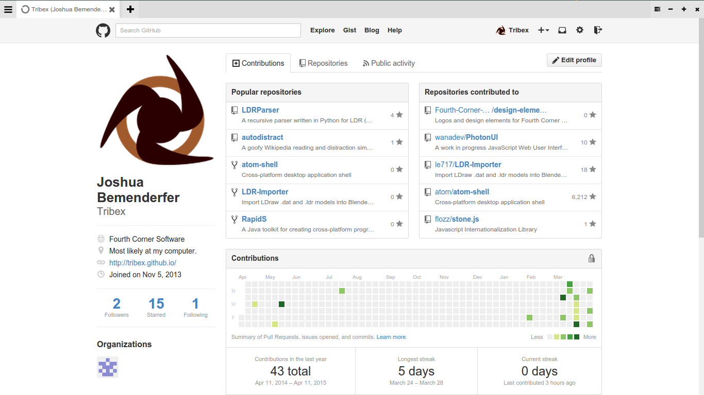

iBrows
===



iBrows is a somewhat sarcastic attempt at an "even more minimalist" web browser stemming from a joke about what Apple's answer to Microsoft's Spartan should be.

All non-webpage functions (tabs, url entry, dev tools, window controls, etc.) are kept in the single titlebar.

iBrows is incredibly extensible and inherently easy to modify and theme. Based on [atom-shell (electron)](http://github.com/atom/atom-shell), it is literally a web browser in a web browser.

This was a week-long project and will likely not be worked on further unless some reason arises. The current web browsers are good enough as it is. :)

##Features:
  * Written with web technologies, easily extended and modified.
  * No annoying buttons or unused features like bookmarks, history, auto-completion, settings, search engines, or the likes.
  * No keyboard shortcuts, who uses those anyways?
  * THE URL BAR IS IN THE TAB! IT SAVES NEARLY 28 PIXELS OF VERTICAL SPACE!
  * Based on Chromium 41 and io.js.
  * You can open lots of tabs. Yay. -_-
  * Dev tools button that does stuff.
  * Take a look at `extensions/ibrows-tabs/`, `resources/app/js/extension.js`, and `resources/app/js/api.js` for information on writing your own extensions. Be warned, the code is pretty much entirely undocumented.
  
##Usage:
 1. Clone or download this repository.
 2. Download [atom-shell](http://github.com/atom/atom-shell/). copy everything except the resources folder into the root directory of the downloaded iBrows repository. Optionally rename atom-shell(.exe) to iBrows(.exe).
 3. Run atom-shell(.exe)/iBrows(.exe).

##Notes:
 * This project was written entirely with the Atom editor, an incredibly extensible text editor for which the back-end for iBrows was originally written for.
 * The C# implementation will be called MonoBrow.
 * There is no url autocomplete or smart bar. Type the urls yourself. (You may omit the protocol though).
 
##License
```
The MIT License (MIT)

Copyright (c) 2015 Joshua Michael Bemenderfer

Permission is hereby granted, free of charge, to any person obtaining a copy
of this software and associated documentation files (the "Software"), to deal
in the Software without restriction, including without limitation the rights
to use, copy, modify, merge, publish, distribute, sublicense, and/or sell
copies of the Software, and to permit persons to whom the Software is
furnished to do so, subject to the following conditions:

The above copyright notice and this permission notice shall be included in all
copies or substantial portions of the Software.

THE SOFTWARE IS PROVIDED "AS IS", WITHOUT WARRANTY OF ANY KIND, EXPRESS OR
IMPLIED, INCLUDING BUT NOT LIMITED TO THE WARRANTIES OF MERCHANTABILITY,
FITNESS FOR A PARTICULAR PURPOSE AND NONINFRINGEMENT. IN NO EVENT SHALL THE
AUTHORS OR COPYRIGHT HOLDERS BE LIABLE FOR ANY CLAIM, DAMAGES OR OTHER
LIABILITY, WHETHER IN AN ACTION OF CONTRACT, TORT OR OTHERWISE, ARISING FROM,
OUT OF OR IN CONNECTION WITH THE SOFTWARE OR THE USE OR OTHER DEALINGS IN THE
SOFTWARE.
```
